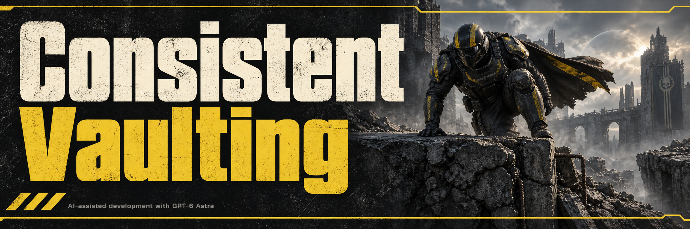

# Consistent Vaulting

Makes manual vaulting more forgiving than vanilla by checking obstacles again when an otherwise usable climb is rejected.

- **Fewer position-sensitive refusals.** Fresh obstacle checks adapt to your approach, and eligible manual retries can recover when an obstacle's vault-blocking tag prevents the normal selection.
- **Higher reachable ledges.** Grounded top detection can temporarily extend climb height from vanilla's 1.95 to 2.5 game units when it finds a suitable landing.
- **Controlled steep-surface climbing.** Validated slopes up to 65 degrees can receive temporary support. Walking speed applies after an assisted steep climb begins and while that bounded support is needed.
- **Normal movement between attempts.** Pressing climb in open space does not slow the Helldiver; allowances require a usable nearby candidate and end when the attempt or support conditions expire.

Changes apply only to your Helldiver. Collision, clearance, reach and moving-obstacle checks still govern whether a climb can happen.

See [validation coverage](docs/MIGRATION_VALIDATION.md) for the scope of the release checks. Routine diagnostics are off by default; developers can set `CowboyBingusDiagnostics = true` before initialization to enable them.

Current version: **v8.6**, for game build **25327279**. See [changes](CHANGELOG.md) and [validation coverage](docs/MIGRATION_VALIDATION.md).
