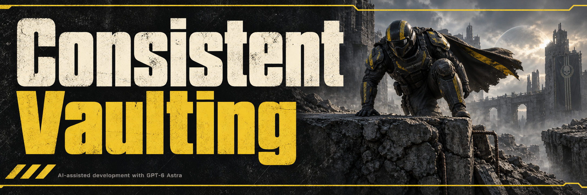

> Release **v8.9** for Steam build 25480438 / EXE 1.8.46015.0. Offline checks passed; vaulting, slope and ledge assists were confirmed in live play.

# Consistent Vaulting

Makes manual vaulting more forgiving than vanilla by checking obstacles again when an otherwise usable climb is rejected.

- **Fewer position-sensitive refusals.** Fresh obstacle checks adapt to your approach, and eligible manual retries can recover when an obstacle's vault-blocking tag prevents the normal selection.
- **Higher reachable ledges.** Grounded top detection can temporarily extend climb height from vanilla's 1.95 to 2.5 game units when it finds a suitable landing.
- **Controlled steep-surface climbing.** Validated slopes up to 65 degrees can receive temporary support. Walking speed applies after an assisted steep climb begins and while that bounded support is needed.
- **Normal movement between attempts.** Pressing climb in open space does not slow the Helldiver; allowances require a usable nearby candidate and end when the attempt or support conditions expire.

Changes apply only to your Helldiver. Collision, clearance, reach and moving-obstacle checks still govern whether a climb can happen.

Release **v8.9** checks once per frame while nothing is in progress, re-verifies your Helldiver instead of locating it on every check, and pauses instead of stopping after errors elsewhere in the update chain. Measured in live play: 0.026 ms per frame in client missions and 0.011 on the ship. Routine diagnostics are off by default; developers can set `CowboyBingusDiagnostics = true` before initialization to enable them.

**Install:** close the game, import `Consistent-Vaulting-v8.9.zip` and Bingus Shared Loader v18 or newer into Arsenal or HD2MM, enable both and Purge / Deploy. With Arsenal's default priority, put the loader last. [Bingus Shared Loader](https://github.com/CowboyBingus/BingusSharedLoader/releases/latest) is a separate required download.

Current version: **v8.9**, for game build **25480438**. See [changes](CHANGELOG.md) and [validation coverage](docs/MIGRATION_VALIDATION.md).

**AI disclosure:** Developed with assistance from GPT-6 Astra and Claude Opus 5.5.

## License

Zero-Clause BSD (0BSD): use, copy, modify and distribute for any purpose, with no conditions. See `LICENSE`.
